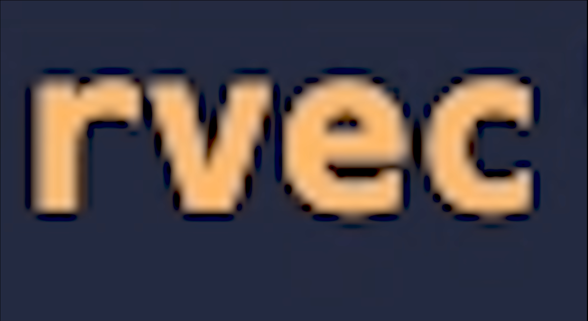

# 

# Rvec

Mathematical library for ruby (Not fully finished)

## Installation

DOWNLOAD FILES AND IMPORT RVEC
THE GEM INSTALL WILL COME SOON
THE INFORMATION BELOW IS FOR WHEN
THE GEM BECOMES PUBLICALLY AVAILABLE

```ruby
"""
note no active gem install
"""
gem 'rvec'
```

And then execute:

    $ bundle install

Or install it yourself as:

    $ gem install rvec

## Rvec functions
Creating random 2D array with custom size:
the array is a 3,1 array with an starting value of 0->1 -1
```ruby
Rvec.array(3,1,-1)
```
Identifying Rvec and normal elements:
note this works for Matrices, 3D-1D arrays, floats,
strings, and integers
```ruby
Rvec.id(3.00)
```
Length:
Get the length of a string, integer, array..
```ruby
Rvec.len("abc")
```
Reverse:
Reverse order a array
```ruby
Rvec.reverse([1,3,2,4])
```
Creating [] or list:
```ruby 
Rvec.list()
```
Creating {} or dictionary:
```ruby
Rvec.set()
```
Array multiplication:
please note the sizes have to work with each other
or else there will be an error
```ruby
Rvec.dot(Rvec.array(3,1,-1),Rvec.array(4,3,0))
```
Exponential function:
note this works with 3D-1D arrays and matrices
```ruby
Rvec.exp(array(3,1,-1))
```
Flattening:
ravel 2D to 1D
```ruby
Rvec.ravel([[1],[2],[3],[4]])
```
Mutliply each element of a 2D array with corresponding element of another array:
note the '4' at the end is for the shift value
```ruby
Rvec.mdt(Rvec.array(3,1,-1),(Rvec.array(3,1,2),4)
```
Divide each element of a 2D array with corresponding element of another array:
note the '4' at the end if for the shift value
```ruby
Rvec.ddt(Rvec.array(3,1,-1),Rvec.array(3,1,2),4)
```
Add each element of a 2D array with corresponding element of another array:
note the '4' at the end is for the shift value
```ruby
Rvec.adt(Rvec.array(3,1,-1),Rvec.array(3,1,2),4)
```
Subtract each element of a 2D array with corresponding element of another array:
note the '4' at the end is for the shift value
```ruby
Rvec.sdt(Rvec.array(3,1,-1),Rvec.array(3,1,2),4)
```
Mutliply all elements in a 3D-1D array by '-1':
```ruby
Rvec.nst(Rvec.array(3,1,-1))
```
Mutliply all elements in a 3D-1D array by '1':
```ruby
Rvec.pst(Rvec.array(3,1,-1))
```
Find a mean given a list:
```ruby
Rvec.mean([1,2,3,4])
```
Mean Squared Number:
Calculate the mean squared number (mse) given a 1D array
```ruby
Rvec.mse([1,2,3,4])
```
Sums of Arrays:
Calculate the sum of a array, 1D, 2D, or 3D
```ruby
Rvec.sum([1,2,3,4])
```
Standard Deviation:
Calculate the std of a 1D array
```ruby
Rvec.std([1,2,3,4])
```
Sum of Squares:
Denote this is the same as mse
```ruby
Rvec.ss([1,2,3,4])
```
Sum of Products:
Caluclate the sum of products given two same sized 1D arrays
```ruby
Rvec.sp([1,2,3,4],[4,3,2,1])
```
## Linear Regression
Regression function:
Find the linear regression given two x and y sets(same size)
```ruby
Rvec.regx([1,2,3,4],[1,4,9,16])
```
Predict function:
Find the prediction of a linear regression model
```ruby
Rvec.predict(1, Rvec.regx([1,2,3,4],[1,4,9,16]))
```

## Polynomial Regression
Polynomial function:
Find & predict input
```ruby
x = [0,1.5,2,3,4,5,6]
y = [0,1.5,2.5,4,4,4.5,5]
degree = 2
/ finding the expected result for an input of 0 /
regx = (Rvec.PolynomialRegression(x,y,degree,type=2))
puts(print(Rvec.predict(0,regx))
```

## Logistic Regression
Find an predict who passes a test based on study hours:
```ruby
require_relative 'rvec'

# Baseline from previous examination
hours_Studied = [1.0, 7.9, 3.1, 6.2, 4.2]
passed_Exam = [0, 1, 0, 1, 0] # --> Where '1' is a pass & '0' is not

# Creating the model from our previous data
model = Rvec.logistic(hours_Studied, passed_Exam)

# New Data for hours studied
hours_Studient_Recent = [3.0, 3.1, 4.2, 7.9, 5.5, 4.3, 6.2, 7.3, 1.0, 5.6]

# This is our predictions since 5.5 and above is a pass generally.
passed_Exam_Recent = [0, 0, 0, 1, 1, 0, 1, 1, 0, 1]

# Predicting our new data
predicting_model = Rvec.predictlog(model, hours_Studient_Recent, passed_Exam_Recent)

# Printing our confusion matrix stats:
puts(print(predicting_model))
```

## Advanced Mathematics
Sigmoid, Sigmoid_derivatives, Errornum are in the advanced mathematics area

sig is the same as '1.0/(1.0+ exp(-x))'
```ruby
@inputs = [[0,1,0],[1,1,1],[1,0,1],[0,0,1]]
@weights = [[-0.54944709],
            [-0.26457845],
            [-0.06770566]]
Rvec.sig(Rvec.nst(Rvec.dot(@inputs, @weights)))
```
sigd is the same as 'x * (1 -x)'
```ruby
@inputs = [[0,1,0],[1,1,1],[1,0,1],[0,0,1]]
@weights = [[-0.54944709],
            [-0.26457845],
            [-0.06770566]]
output = (Rvec.sig(Rvec.nst(Rvec.dot(@inputs, @weights))))
Rvec.sigd(output)
```
errornum is apt
```ruby
@inputs = [[0,1,0],[1,1,1],[1,0,1],[0,0,1]]
@output = ([[0+1+1+0]].transpose) and @output.each{|sublist| sublist.each{|item| @output = item} }
@weights = [[-0.54944709],
            [-0.26457845],
            [-0.06770566]]
                        
output = Rvec.sig(Rvec.nst(Rvec.dot(@inputs, @weights)))
Rvec.apt(@output, output)
```
## Experimental Functions
The following below is for the python graphing stuff

Background graphing colour:
```python
set_bgcolor(str) 
"""i.e set_bgcolor("blue")"""
```
Function & Axis Colour:
```python
set_color(str)
"""i.e set_color("black")"""
```
Changing x Axis Size:
```python
set_x(int)
"""i.e set_x(20)"""
```
Changing y Axis Size:
```python
set_y(int)
"""i.e set_y(18)"""
```
Graphing a function:
```python
set_func(str)
"""i.e set_func("1*(x)+1")"""
```
Setting Graphing Mode:
Can only be 0,1,2,3 or 4
```python
set_mode(int)
"""i.e set_mode(0) <-- this is the best one"""
```
Showing the Graph:
```python
graph()
```
## Artifical Intelligence
Note: The rvec framework is being compared to the 'NumPy' framework

The following example is a super easy and simple training algorithm written in rvec
```ruby
@inputs = [[0,1,0],[1,1,1],[1,0,1],[0,0,1]]
@output = ([[0+1+1+0]].transpose) and @output.each{|sublist| sublist.each{|item| @output = item} }
@weights = array(3,1,-1)

def train(training_set_inputs, training_set_outputs, number_of_training_iterations)
    number_of_training_iterations.times do
        output = (sig(nst(dot(training_set_inputs, @weights))))
        error = apt(@output, output)
        adjustment = dot(training_set_inputs.transpose, mdt(error, sigd(output), 4))
        weights = @weights
        @weights = adt(weights, adjustment, 4)
    end
end
puts("Starting synaptic weights:")
puts(print(@weights))
puts("Trained synaptic weights:")
train(@inputs, @output, 1000)
puts(print(@weights))
```
## Development

After checking out the repo, run `bin/setup` to install dependencies. You can also run `bin/console` for an interactive prompt that will allow you to experiment.

To install this gem onto your local machine, run `bundle exec rake install`. To release a new version, update the version number in `version.rb`, and then run `bundle exec rake release`, which will create a git tag for the version, push git commits and the created tag, and push the `.gem` file to [rubygems.org](https://rubygems.org).

## Contributing

Bug reports and pull requests are welcome on GitHub at https://github.com/Answerious/Rvec. This project is intended to be a safe, welcoming space for collaboration, and contributors are expected to adhere to the [code of conduct](https://github.com/Answerious/Rvec/blob/master/CODE_OF_CONDUCT.md).

## Code of Conduct

Everyone interacting in the Rvec project's codebases, issue trackers, chat rooms and mailing lists is expected to follow the [code of conduct](https://github.com/Answerious/Rvec/blob/master/CODE_OF_CONDUCT.md).
